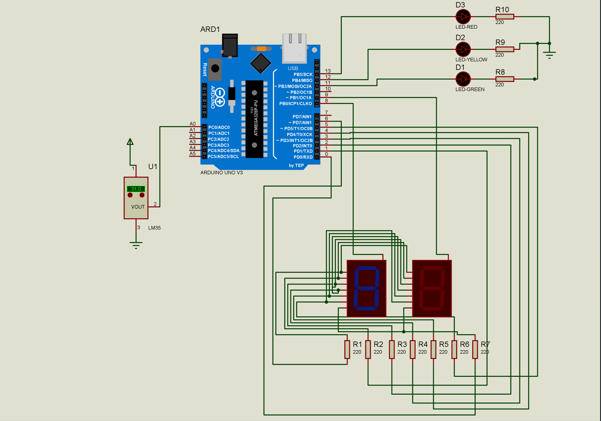
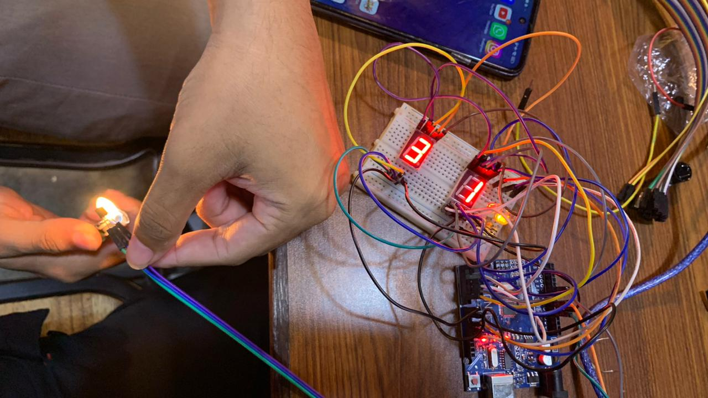

# Temperature Monitoring System: LM35 & Seven Segment

Sistem pemantauan suhu *real-time* berbasis mikrokontroler AVR (ATmega328P). Proyek ini mengimplementasikan manipulasi register tingkat rendah untuk pembacaan sensor LM35 yang presisi menggunakan interupsi perangkat keras (*Timer2 ISR*) dan teknik *multiplexing* tanpa efek bayangan (*flicker-free*) untuk tampilan Seven Segment 2-digit.

## Arsitektur Perangkat Keras
Sistem ini dirancang untuk dijalankan pada arsitektur **Arduino Uno/Nano** (AVR) dengan optimasi penggunaan memori melalui akses register langsung.

### Kebutuhan Komponen:
1. Arduino Uno / Nano
2. Sensor Suhu LM35
3. Display Seven Segment 2-Digit (Common Anode)
4. 3x LED Indikator (Merah, Kuning, Hijau)
5. Transistor NPN (untuk Switching Digit)

### Matriks Pengkabelan (Pinout)
| Komponen | Pin Arduino | Tipe Logika |
| :--- | :--- | :--- |
| Sensor LM35 | `A0` | Analog Input |
| Seven Segment (a-g) | `PORTD (0-6)` | Digital Output |
| Buzzer | `PD7 (Pin 7)` | Digital Output (Active HIGH) |
| Transistor Digit 1 | `PB0 (Pin 8)` | Control (Active HIGH) |
| Transistor Digit 2 | `PB1 (Pin 9)` | Control (Active HIGH) |
| LED Aman (Hijau) | `PB3 (Pin 11)`| Digital Output |
| LED Waspada (Kuning)| `PB4 (Pin 12)`| Digital Output |
| LED Bahaya (Merah) | `PB5 (Pin 13)`| Digital Output |

## Parameter Kalibrasi Sistem
Sistem beroperasi secara asinkron; pembaruan tampilan berjalan di loop utama, sementara evaluasi suhu dilakukan setiap 500ms melalui interupsi:
* **Kondisi Aman (< 30°C):** LED Hijau aktif.
* **Kondisi Waspada (30°C - 35°C):** LED Kuning aktif.
* **Kondisi Bahaya (> 35°C):** LED Merah aktif
* **Sampling Rate:** 2Hz (Satu konversi ADC setiap 500ms) menggunakan Timer2 ISR.

## Deployment (Instalasi)

### Opsi 1: Menggunakan PlatformIO
1. Kloning repositori ini.
2. Buka folder proyek menggunakan Visual Studio Code dengan ekstensi PlatformIO.
3. Pastikan mikrokontroler terhubung ke komputer.
4. Eksekusi perintah `Build` dan `Upload`. Konfigurasi otomatis tersedia pada file `platformio.ini`.

### Opsi 2: Menggunakan Arduino IDE
1. Unduh repositori ini sebagai file ZIP lalu ekstrak.
2. Pindahkan seluruh kode sumber yang ada di dalam `src/main.cpp` ke dalam file baru bernama `Suhu_LM35.ino`.
3. Buka file tersebut menggunakan Arduino IDE.
4. Pilih *Board* (Arduino Uno/Nano) dan klik tombol **Upload**.

### Diagram Skematik Rangkaian

## Dokumentasi

